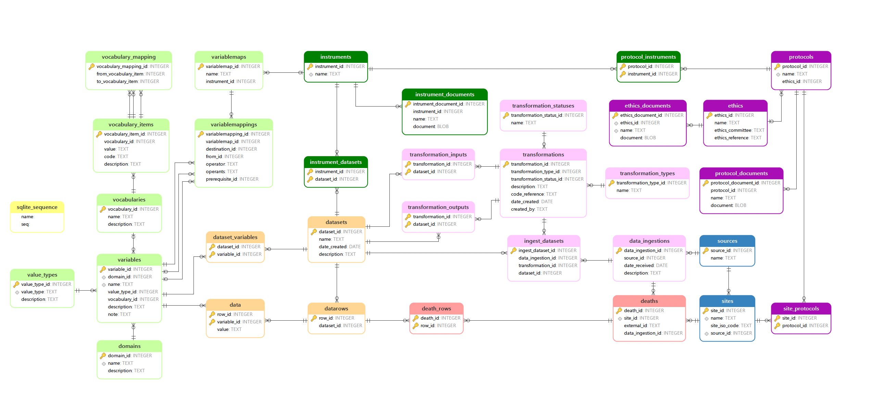

# Reference Death Archive (RDA)

The Reference Death Archive (RDA) project has been specifically designed to cater to users of the Verbal Autopsy HDSS dataset. RDA's primary objective is to streamline and automate the process of ingesting Verbal Autopsy data into the core data archive while facilitating its conversion to the ICD (International Classification of Diseases) standards through the InterVA and inSilico VA systems.

RDA is engineered using Julia code and SQLite, ensuring consistency and rapid data processing. Its versatility makes it accessible and beneficial for a wide range of Verbal Autopsy users, simplifying the otherwise complex data management tasks.

This documentation serves as a comprehensive guide to understanding the key structures of the RDA data archive system and the relationships between key variables. For a deeper dive into the specifics of each module, you'll find more detailed information provided separately.

1. [`RDA Ingest.jl`](@ref)
2. [`RDA Clean.jl`](@ref)
3. [`RDA Convert.jl`](@ref)

## Multiple Sources Death Registered Data

The utilization of data from various geographical locations or the strategic design of multi-site studies can significantly enhance the representational accuracy of a given region. This approach leads to the establishment of an integrated Decision Support System (DSS)-sample vital registration system, serving as a cost-effective foundational data collection platform. This platform not only achieves international representativeness but also provides a detailed perspective at the regional level, enabling in-depth research investigations.

To uphold data integrity and distinguish between individual sites, a unique identifier is assigned to each site. This identifier is consistently applied across all primary data tables within the Reference Death Archive (RDA), ensuring a clear demarcation between the primary data of different sites.

### Project Objective 
The primary aim of this project is to achieve the following:

1. **Automatic Data Updates**: Implement a system that automatically updates with new data sources. This will simplify the process of keeping the system up-to-date.

2. **Streamlined Workflow**: Create a more transparent and efficient workflow. This will enhance the overall clarity and ease of operation within the system.

3. **Simplification of RDA Modules**: Within the three key modules of RDA, namely, RDA Ingest, RDA Clean, and RDA Convert, strive to make each step more straightforward and user-friendly. This simplification will improve usability and accessibility. 

### 1. Data Structure & Schema
The conceptual model of the *Reference Death Archive* is presented in Figure 1.

This diagram provides an overview of how different tables are interconnected within the system. In the diagram, tables are depicted as boxes, with their names placed at the upper section of each box. Field names are located in the lower section. Primary keys are indicated with "key" signs next to the relevant items, and relationships between tables are depicted using "crows feet" lines. These lines connect tables based on foreign key relationships, with the many side of the relationship represented by the crow's foot symbol. Additionally, each variable is associated with a defined data type to ensure data consistency.

#### The schema is color-coded based on its orientation and sources.
   -  Blue : Sources and Sites
   -  Purple :  Site Protocals and Ethic documents
   -  Green : Instrument documents
   -  Pink : Transformation
   -  Orange : Dataset
   -  Salmon : Death information
   -  Lightgreen : Variables and mappings 

### 2. Sources

- The `source_id` in the *sources* table serves as the primary key, uniquely identifying each data source.

- In the *sites* table, the `source_id` serves as a foreign key variable, establishing a link between the sources of data and the specific sites where the data originates. Additionally, `site_id` is designated as the primary key within the *sites* table.

- These `source_id` and `site_id` identifiers serve as the foundational starting points for collecting death data and managing data ingestion events, facilitating the seamless ingestions of data into the system.

All the relevant origin of the data is elucidated through the following tables:

| Table Name              | Description                                                                   |
|:----------------------- | :---------------------------------------------------------------------------- |
| sources                 | The entity responsible for distributing the data                              |
| sites                   | The surveillance site whre the data collection (or death) occured             |

### 3. Data Collection (Protocols & Ethics)

- Within the data architecture, the *site_protocols* table establishes a many-to-many relationship. This connection is achieved through the use of a `protocol_id` foreign key, which links to the *protocols* table. The *protocols* table, in turn, includes an `ethics_id` (foreign key) to establish a connection with the *ethics* table. Utilizing `ethics_id` as a foreign key variable, the documentation further details the *ethics_documents* table, while `protocol_id` serves as the foreign key variable for documenting the *protocol_documents* table. 

The detailed information pertaining to data collection protocols and ethical approvals is documented in the following tables:

| Table Name              | Description                                                                   |
|:----------------------- | :---------------------------------------------------------------------------- |
| protocols               | A data collection protocol                                                    |
| site_protocols          | Links the protocols implemented at a site                                     |
| protocol_documents      | Documents describing the protocol                                             |
| ethics                  | An ethics approval for data collection                                        |
| ethics_documents        | Documents describing the ethical approval                                     |

### 4. Data collection (Instruments)
- The *protocol_instruments* table plays a pivotal role in establishing connections between protocols and instruments. It links to the *instruments* table using the `instrument_id` as a foreign key. Simultaneously, the `instrument_id` in the *instruments* table serves as the primary key. This connection extends further to the *instrument_documents* table and the *instrument_datasets* table.

- In the *instrument_documents* table, the `instrument_id` is utilized as a foreign key.

- Similarly, the *instrument_datasets* table also employs the `instrument_id` as a foreign key. This linkage sets the stage for future connections with datasets and variable maps, which will be elaborated upon in subsequent steps.

An overview of the data collection instruments is provided in the following tables:

| Table Name              | Description                                                                   |
|:----------------------- | :---------------------------------------------------------------------------- |
| instrument              | A data collection isnstrument                                                 |
| instrument_documents    | Documents describing the instrument, or instrument questionnaire              |
| protocol_instruments    | The instruments covered by a particular protocol                              |
| instrument_datasets     | Datasets collected by this instrument                                         |

### 5. Datasets

- From the *sources* to *data_ingestions*, a connection is established through the `data_ingestion_id`, which is linked with the `dataset_id`. Additionally, the `instrument_id` serves as a foreign key in the *datasets* table, where `dataset_id` is the primary key.

- The *datasets* table also forms relationships with *datarows* and *dataset_variables*, using `dataset_id` as a foreign key.

- Moving from *datarows*, the `row_id`, originally assigned as a foreign key from the Death Rows, is collected. These rows are subsequently translated into data, with the `row_id` serving as a foreign key.

- Additionally, the *datarows* table contains a `variable_id`, which can be further related to *variables*, a topic that will be covered in the next section.

The actual data is stored and organized within the following tables:

| Table Name              | Description                                                                   |
|:----------------------- | :---------------------------------------------------------------------------- |
| datasets                | The dataset identifier and name                                               |
| datarows                | The row identifier for each row in the dataset                                |
| data                    | A variable - value pair for each variable in each row of the dataset          |
| dataset_variables       | The variables representing each column in the dataset                         |

### 6. Variables and mappings

- The *variables* table is linked to the `variable_id` as a foreign key from both the *dataset_variables* and *data* tables. These variables are primarily sourced from the sites providing data. Additionally, they are linked to their respective *domains* tables using the `domain_id` as a foreign key.

- By utilizing the `vocabulary_id` as a foreign key, *variables* can be linked to *vocabularies* and *vocabulary_items*.

- The connection extends to the *variablemaps* tables, originating from instruments, and *variablemappings* from the CDC sites/standardized variables. These mappings allow for the conversion of variable mappings to variables using `destination_id`, `from_id`, and `prerequisite_id` to reference the variable ID.

- Moreover, variables employ a `value_type_id` as a foreign link to the *value_types* table. This relationship provides insight into the value type of each variable, maintaining consistency with data types.

The tables that describe the variables representing the data within the dataset are as follows:

| Table Name              | Description                                                                   |
|:----------------------- | :---------------------------------------------------------------------------- |
| domains                 | Variable names are unique within a domain                                     |
| variables               | Documents a variable                                                          |
| value_types             | Representing the different datatypes, variables can assume                    |
| vocabularies            | The values a categorical variables can assume, are contained in a vocabulary  |
| vocabulary_items        | The individual categories (codes) in a vocabulary                             |
| vocabulary_mapping      | The items of one vocabulary can be mapped to another vocabulary               |

### 7. Transformations

- During the data ingestion process, transformations and their corresponding `transformation_id` and `ingest_id` are established. These transformations are directly linked to the `dataset_id` in the Datasets table.

- The `transformation_id` interacts with both the *transformation_inputs* and *transformation_outputs* tables, both of which are connected to the `dataset_id`. However, the data for these interactions is sourced from the *transformations* table, where the `transformation_id` serves as a foreign key.

An instance of data ingestion into the Reference Death Archive is detailed through the following tables:

| Table Name              | Description                                                                   |
|:----------------------- | :---------------------------------------------------------------------------- |
| data_ingestions         | Records the data ingest instances                                             |
| transformations         | Documents the data transformation (extraction, transformation and loading)    |
| transformation_types    | Whether the transformation operates on raw (data ingest) or existing datasets |
| transformation_statuses | Whether the transformation has been verfied or not                            |
| ingest_datasets         | The datasets containing the raw data from the data ingest                     |
| transformation_inputs   | The dataset/s consumed by the transformation for a dataset transformation     |
| transformation_outputs  | The dataset/s produced by the transformation                                  |

## Conclusion
In conclusion, this documentation serves as an essential reference for understanding the Reference Death Archive (RDA). It provides a clear overview of the system's structure, including data sources, collection protocols, instruments, datasets, variables, mappings, and transformations. With this foundational knowledge, users and developers can efficiently navigate and utilize the RDA for diverse research and analytical purposes, ensuring its continued effectiveness as a valuable data management platform.