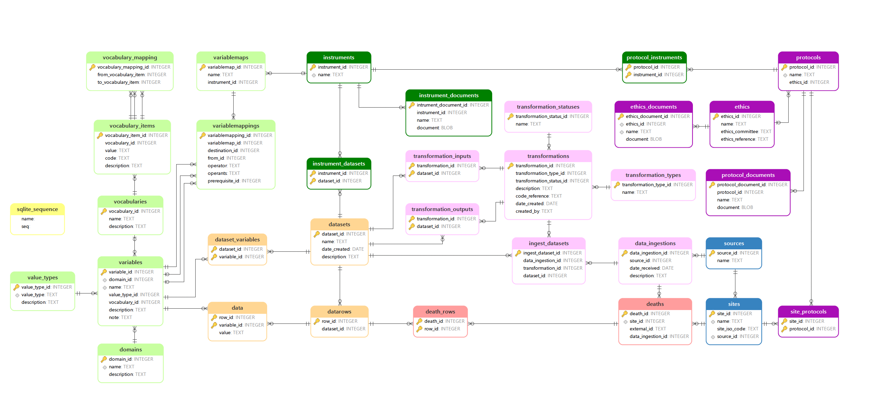

# Reference Death Archive (RDA)
RDA project is developed for users of Verbal Autopsy HDSS dataset. RDA is geared to automate ingest the Verbal Autopsy data to the core data archive, and convert to the ICD interVA / inSilico VA systems with designed flow. 

All the systems is built and developed in Julia code to be consistent and quick digestion, and which can be broadly used for any VA users. 

This documentation is to describe the key sturctures of the data archive system and key variables relationships. More detailed information for each modolue is described in.

1. [`RDA Ingest.jl`](@ref)
2. [`RDA Clean.jl`](@ref)
3. [`RDA Convert.jl`](@ref)

## Multiple Sources Death Registered Data

Utilizing  data sources from  multiple  sites,  or  
better  yet  designing  prospective  multi-site  studies,  improves  the  representativeness  of the region. The  result  of  a  combined  DSS-sample  vital  registration  system  would  be  a  comparatively  inexpensive  basic  data   collection  platform  that  is  both  nationally  representative  and  detailed  enough  at  the   regional level to provide a means of conducting in-depth investigations. Each  site  is  assigned  a  unique  identifier  that  is  used  to differentiate  each  site’s  primary  data  from  the  primary  data  from  other  sites  in  all  the   primary data tables in RDA.

In the case of the CHAMPS data, the data dictionaries are manually extracted from the data distribution document and saved as csv files in the RDA repository.
The format of the file is (the field separator is a semi-colon):
 * `Column_Name`: The variable name
 * `Key` : `Yes` if the variable is a key to the data
 * `Description`: The description of the variable, if the description contains more than one line, in the case of a categorical variable, the vocabulary appears from line two onwards as comma separated text containing code and description.
 * `Note`: A note regarding the variable

### Aim 
Through make this systems, the obejective of this project is 
- With the updates of data sources, it can be updated automatically simple use.
- Clearer work flow 
- Three main modules of RDA Ingest, RDA Clean, RDA convert, we can make more strightforward and simplify each step. 

### 1. Data Structure & Scheme
The conceptual model of the *Reference Death Archive* is shown in Figure 1.

This overall describe how the each islands of table linked to each other. Tables are represented by boxes, table names are in the upper section of each box, field  names  are  in  the  lower  section  of  each  box,  primary keys  are  appeared with "key" signs next to items, and relationships are represented by the “crows feet” lines between tables –for foreign key relationship with the many side of the relationship represented by the crow’s foot. Next to each variable, there is a data type is defined to maintain the consistency.

### 2. Sources

Sources sites/ protocols

The origin of the data is described in the following tables:
The **source_id** in the *Sources* table is the primary key and in the *sites* table **source_id** is the foreignkey variable to link the sourcoes of sites and  **site_id** is the primary key. Source_id and Sites_id is the starting point to collect the death data and data_ingestions events to digest the data into the system.

| Table Name              | Description                                                                   |
|:----------------------- | :---------------------------------------------------------------------------- |
| sources                 | The entity responsible for distributing the data                              |
| sites                   | The surveillance site whre the data collection (or death) occured             |

### 3. Data Collection (Protocols & Ethics)
The data collection protocol and ethical approval are described in the following tables: Through the table *the site protocols* many to many rleationship, with the **protocol_id** foreign key  linked to protocol table which has ethics_id (foreign key) to connect to ethics table  and also connect to protocol instruments which is further directed to instruments which will be described in the following section.

| Table Name              | Description                                                                   |
|:----------------------- | :---------------------------------------------------------------------------- |
| protocols               | A data collection protocol                                                    |
| site_protocols          | Links the protocols implemented at a site                                     |
| protocol_documents      | Documents describing the protocol                                             |
| ethics                  | An ethics approval for data collection                                        |
| ethics_documents        | Documents describing the ethical approval                                     |

### 4. Data collection instruments
The data collection instruments are described in the following tables: In the instruments, 

| Table Name              | Description                                                                   |
|:----------------------- | :---------------------------------------------------------------------------- |
| instrument              | A data collection isnstrument                                                 |
| instrument_documents    | Documents describing the instrument, or instrument questionnaire              |
| protocol_instruments    | The instruments covered by a particular protocol                              |
| instrument_datasets     | Datasets collected by this instrument                                         |

### 5. Datasets
The data itself is contained in the following tables:

| Table Name              | Description                                                                   |
|:----------------------- | :---------------------------------------------------------------------------- |
| datasets                | The dataset identifier and name                                               |
| datarows                | The row identifier for each row in the dataset                                |
| data                    | A variable - value pair for each variable in each row of the dataset          |
| dataset_variables       | The variables representing each column in the dataset                         |

### 6. Variables
The variables representing the data contained in the dataset, is described by the following tables:

| Table Name              | Description                                                                   |
|:----------------------- | :---------------------------------------------------------------------------- |
| domains                 | Variable names are unique within a domain                                     |
| variables               | Documents a variable                                                          |
| value_types             | Representing the different datatypes, variables can assume                    |
| vocabularies            | The values a categorical variables can assume, are contained in a vocabulary  |
| vocabulary_items        | The individual categories (codes) in a vocabulary                             |
| vocabulary_mapping      | The items of one vocabulary can be mapped to another vocabulary               |

### 7. Deaths
Core deaths register as 

### 8. Mapping 
Mapping to CDC regiestration. synced to standardized variablle inter VA and insilicoVA

### 9. Transportations
With the updates of datasets, and the 

An instance of a data ingest into the *Reference Death Archive* is described by the following tables:

| Table Name              | Description                                                                   |
|:----------------------- | :---------------------------------------------------------------------------- |
| data_ingestions         | Records the data ingest instances                                             |
| transformations         | Documents the data transformation (extraction, transformation and loading)    |
| transformation_types    | Whether the transformation operates on raw (data ingest) or existing datasets |
| transformation_statuses | Whether the transformation has been verfied or not                            |
| ingest_datasets         | The datasets containing the raw data from the data ingest                     |
| transformation_inputs   | The dataset/s consumed by the transformation for a dataset transformation     |
| transformation_outputs  | The dataset/s produced by the transformation                                  |

## Conclusion
With this documentation, serves the basic works, and developed more