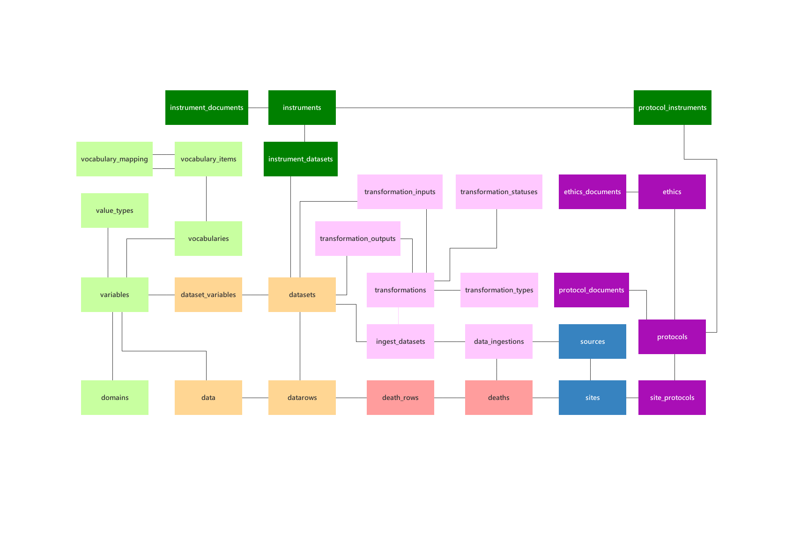

## Introduction

This package creates and ingest data for the *Reference Death Archive* into an SQLite database.

Database creation is done using the [`createdatabase`](@ref) function.

Data ingestion is specific to a source, where a *source* is an entity that distributes/shares data related to a death, for example, verbal autopsy or assigned cause of death data.

The current version of **RDAIngest.jl** can ingest the *Level 2: De-identified data* distributed by [CHAMPS](https://champshealth.org/data/).

See the [`ingest_champs`](@ref) function.

### Database Structure

The conceptual model of the *Reference Death Archive* is shown in Figure 1.

#### Data sources

The origin of the data is described in the following tables:

| Table Name              | Description                                                                   |
|:----------------------- | :---------------------------------------------------------------------------- |
| sources                 | The entity responsible for distributing the data                              |
| sites                   | The surveillance site whre the data collection (or death) occured             |

#### Data collection

The data collection protocol and ethical approval are described in the following tables:

| Table Name              | Description                                                                   |
|:----------------------- | :---------------------------------------------------------------------------- |
| protocols               | A data collection protocol                                                    |
| site_protocols          | Links the protocols implemented at a site                                     |
| protocol_documents      | Documents describing the protocol                                             |
| ethics                  | An ethics approval for data collection                                        |
| ethics_documents        | Documents describing the ethical approval                                     |

#### Data collection instruments

The data collection instruments are described in the following tables:

| Table Name              | Description                                                                   |
|:----------------------- | :---------------------------------------------------------------------------- |
| instrument              | A data collection isnstrument                                                 |
| instrument_documents    | Documents describing the instrument, or instrument questionnaire              |
| protocol_instruments    | The instruments covered by a particular protocol                              |
| instrument_datasets     | Datasets collected by this instrument                                         |

#### Data ingest

An instance of a data ingest into the *Reference Death Archive* is described by the following tables:

| Table Name              | Description                                                                   |
|:----------------------- | :---------------------------------------------------------------------------- |
| data_ingestions         | Records the data ingest instances                                             |
| transformations         | Documents the data transformation (extraction, transformation and loading)    |
| transformation_types    | Whether the transformation operates on raw (data ingest) or existing datasets |
| transformation_statuses | Whether the transformation has been verfied or not                            |
| ingest_datasets         | The datasets containing the raw data from the data ingest                     |
| transformation_inputs   | The dataset/s consumed by the transformation for a dataset transformation     |
| transformation_outputs  | The dataset/s produced by the transformation                                  |

#### Data

The data itself is contained in the following tables:

| Table Name              | Description                                                                   |
|:----------------------- | :---------------------------------------------------------------------------- |
| datasets                | The dataset identifier and name                                               |
| datarows                | The row identifier for each row in the dataset                                |
| data                    | A variable - value pair for each variable in each row of the dataset          |
| dataset_variables       | The variables representing each column in the dataset                         |

#### Variables
The variables representing the data contained in the dataset, is described by the following tables:

| Table Name              | Description                                                                   |
|:----------------------- | :---------------------------------------------------------------------------- |
| domains                 | Variable names are unique within a domain                                     |
| variables               | Documents a variable                                                          |
| value_types             | Representing the different datatypes, variables can assume                    |
| vocabularies            | The values a categorical variables can assume, are contained in a vocabulary  |
| vocabulary_items        | The individual categories (codes) in a vocabulary                             |
| vocabulary_mapping      | The items of one vocabulary can be mapped to another vocabulary               |
